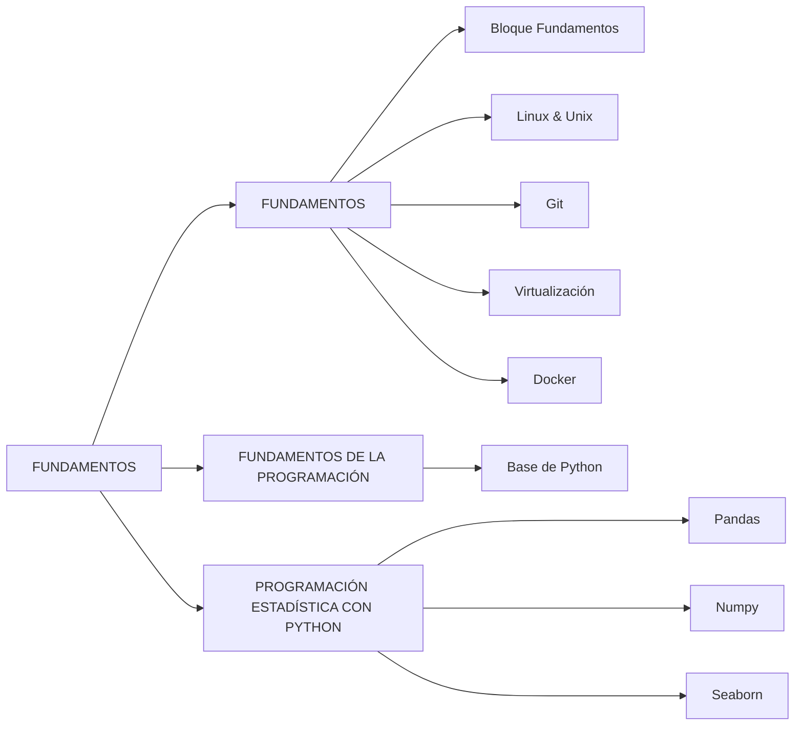

```mermaid
flowchart LR
A[FUNDAMENTOS] -->B[FUNDAMENTOS];
A[FUNDAMENTOS] -->C[FUNDAMENTOS DE LA PROGRAMACIÓN]
A[FUNDAMENTOS] -->D[PROGRAMACIÓN ESTADÍSTICA CON PYTHON]
B[FUNDAMENTOS] -->E[Bloque Fundamentos]
B[FUNDAMENTOS] -->F[Linux & Unix]
B[FUNDAMENTOS] -->G[Git]
B[FUNDAMENTOS] -->H[Virtualización]
B[FUNDAMENTOS] -->I[Docker]
C[FUNDAMENTOS DE LA PROGRAMACIÓN] -->J[Base de Python]
D[PROGRAMACIÓN ESTADÍSTICA CON PYTHON] --->K[Pandas]
D[PROGRAMACIÓN ESTADÍSTICA CON PYTHON] --->L[Numpy]
D[PROGRAMACIÓN ESTADÍSTICA CON PYTHON] --->M[Seaborn]
```