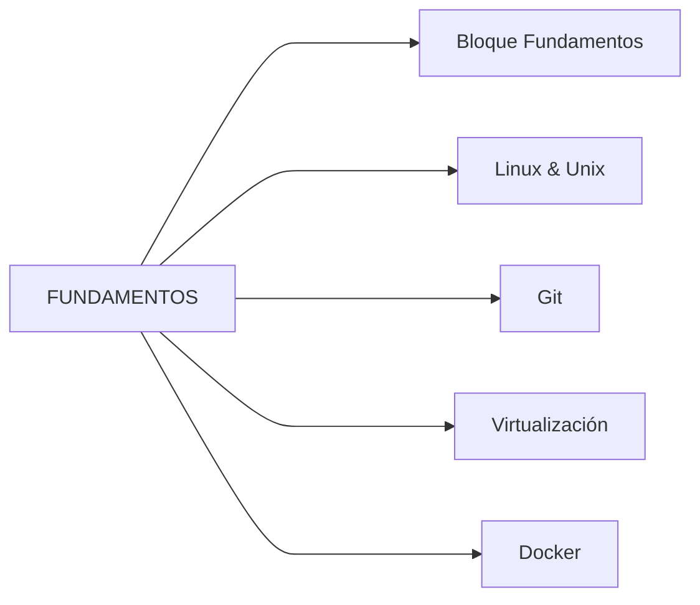

```mermaid
flowchart LR
A[FUNDAMENTOS] ---->B[Bloque Fundamentos]
A[FUNDAMENTOS] ---->C[Linux & Unix]
A[FUNDAMENTOS] ---->D[Git]
A[FUNDAMENTOS] ---->E[Virtualización]
A[FUNDAMENTOS] ---->F[Docker]
```
