<strong>PROGRAMACION
</strong>

Parte 1
</strong>

**¿Qué es programar? ¿Qué es un programa?**

Instrucciones dictadas al ordenador y que éste realiza al ser convertidas en impulsos eléctricos.

Y los programas tienen como intención ejecutar y automatizar tareas rutinarias.

Programar consiste pues en decirle a una máquina que realice determinada tarea.

**¿Qué es la Ingeniería del software?**

Ciencia que estudie el diseño y creación de productos software para que sean: eficaces, eficientes, extensibles, rentables y mantenibles en el tiempo.

**¿Qué son los lenguajes de Programación?**

Son los que nos ofrecen la posibilidad de controlar una computadora. Con éstos podemos crear secuencias de órdenes y crear soluciones a problemas humanos. Todos los lenguajes contienen en común alfabeto, reglas sintácticas, reglas semánticas, convencionalismos, reglas léxicas y estándares.

**Generaciones históricas de los lenguajes:**

- **1era** generación, las instrucciones accedían directamente al hardware, eran poco inteligibles, se realizaban en código máquina (binario) y se conocen como lenguajes de Bajo Nivel.
- **2da** generación, o programación simbólica, planteamiento de las instrucciones más sencillas y comprensibles para el humano, series equivalentes al lenguaje máquina llamado lenguaje ensamblador.
- **3era** generación, lenguajes de medio y alto nivel, los cuales son más parecidos al humano, pueden ser utilizados para crear programas (no solo manejar el ordenador).
- **4ta** generación, lenguajes de alto nivel, se asemejan aún más al lenguaje humano y son creados para reducir el tiempo de desarrollo y para minimizar el coste y esfuerzo del desarrollo. Estos lenguajes pertenecen a la familia de las bases de datos, análisis y manipulación de datos, generación de informes, desarrollo web y móvil y otros GUI.
- ¿Hay **5ta** generación? No es oficial, pero son los lenguajes relacionados con la IA y ML.

**Todo lenguaje de programación cuneta con una serie de elementos comunes:**

```mermaid
graph TD;
A[Elementos comunes] -->B[Sintaxis];
A[Elementos comunes] -->C[Tipos de datos];
A[Elementos comunes] -->D[Variables];
A[Elementos comunes] -->E[Identificadores];
A[Elementos comunes] -->F[Funciones];
A[Elementos comunes] -->G[Directivas];
A[Elementos comunes] -->H[Condicionales y Bucles];
A[Elementos comunes] -->I[Palabras Reservadas];
A[Elementos comunes] -->J[Operadores];
A[Elementos comunes] -->K[Signos de Puntuación];
A[Elementos comunes] -->L[Separadores];
A[Elementos comunes] -->M[Expresiones];
A[Elementos comunes] -->N[Errores de diversos tipos];
A[Elementos comunes] -->O[Depuración];
```

La sintaxis en un lenguaje son las reglas que establecen los criterios para construir y secuenciar un lenguaje. Y la semántica establece el significado a cada uno de los elementos del lenguaje.

**Diferencias entre lenguajes alto y bajo nivel:** 

**Bajo nivel**: Lenguaje máquina, binario (el 1 pasa la electricidad y el 0 no la pasa) que se ejecuta directamente por la CPU y el más cercano al lenguaje de una máquina. Para entender el binario basta con saber las potencias de 2.

</a>

**Medio nivel**: suficiente para que un humano comprenda sin demasiadas complicaciones.

**Alto nivel**: cualquier humano comprender el lenguaje.

**Lenguaje compilado vs interpretado**

El compilado es de alto nivel y necesita de otro programa (compilador) para traducir el código a lenguaje máquina. El lenguaje interpretado no necesita de otro programa, es traducido directamente a lenguaje máquina.

El compilado, requiere la traducción para la ejecución y está por tanto optimizado para ese momento; el interpretado, es convertido a lenguaje máquina mientras se ejecuta y por tanto está optimizado para el desarrollo.

La ventaja del compilado es que es más rápido ya que el ejecutable está en lenguaje máquina y no necesita ser traducido a medida que se va ejecutando. Sin embargo, cada vez que se cambia el código debe realizarse la compilación.

La ventaja del interpretado es que el tiempo entre escritura y probar es menor, por eso es mejor para el desarrollo. Sin embargo, la velocidad de ejecución es menor y se necesita un intérprete instalado.
