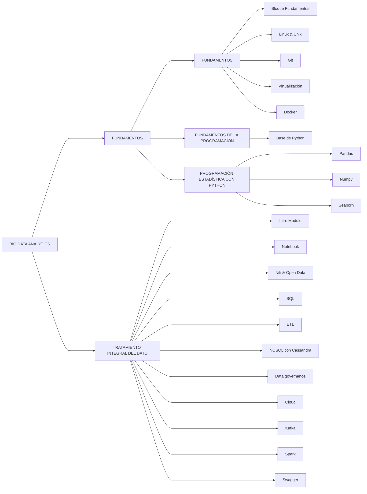

```mermaid
flowchart LR
A[BIG DATA ANALYTICS] ---->B[FUNDAMENTOS];
A[BIG DATA ANALYTICS] ---->C[TRATAMIENTO INTEGRAL DEL DATO];
B[FUNDAMENTOS] --->D[FUNDAMENTOS];
B[FUNDAMENTOS] --->E[FUNDAMENTOS DE LA PROGRAMACIÓN]
B[FUNDAMENTOS] --->F[PROGRAMACIÓN ESTADÍSTICA CON PYTHON]
D[FUNDAMENTOS] -->G[Bloque Fundamentos]
D[FUNDAMENTOS] -->H[Linux & Unix]
D[FUNDAMENTOS] -->I[Git]
D[FUNDAMENTOS] -->J[Virtualización]
D[FUNDAMENTOS] -->K[Docker]
C[TRATAMIENTO INTEGRAL DEL DATO] ---->L[Intro Modulo]
C[TRATAMIENTO INTEGRAL DEL DATO] ---->M[Notebook]
C[TRATAMIENTO INTEGRAL DEL DATO] ---->N[Nifi & Open Data]
C[TRATAMIENTO INTEGRAL DEL DATO] ---->O[SQL]
C[TRATAMIENTO INTEGRAL DEL DATO] ---->P[ETL]
C[TRATAMIENTO INTEGRAL DEL DATO] ---->Q[NOSQL con Cassandra]
C[TRATAMIENTO INTEGRAL DEL DATO] ---->R[Data governance]
C[TRATAMIENTO INTEGRAL DEL DATO] ---->S[Cloud]
C[TRATAMIENTO INTEGRAL DEL DATO] ---->T[Kafka]
C[TRATAMIENTO INTEGRAL DEL DATO] ---->U[Spark]
C[TRATAMIENTO INTEGRAL DEL DATO] ---->V[Swagger]
E[FUNDAMENTOS DE LA PROGRAMACIÓN] -->W[Base de Python]
F[PROGRAMACIÓN ESTADÍSTICA CON PYTHON] --->X[Pandas]
F[PROGRAMACIÓN ESTADÍSTICA CON PYTHON] --->Y[Numpy]
F[PROGRAMACIÓN ESTADÍSTICA CON PYTHON] --->Z[Seaborn]
```