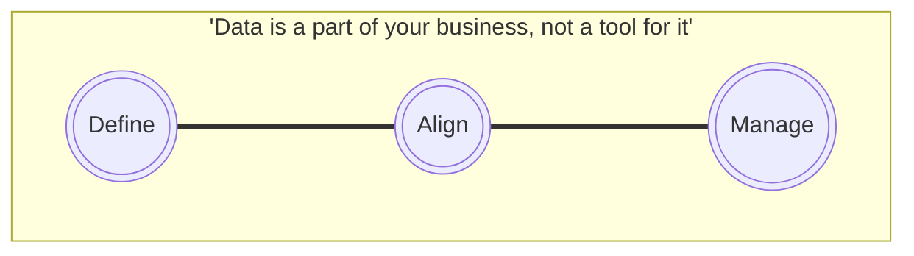
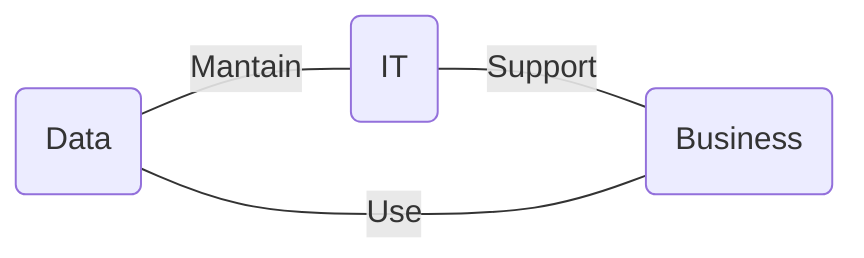
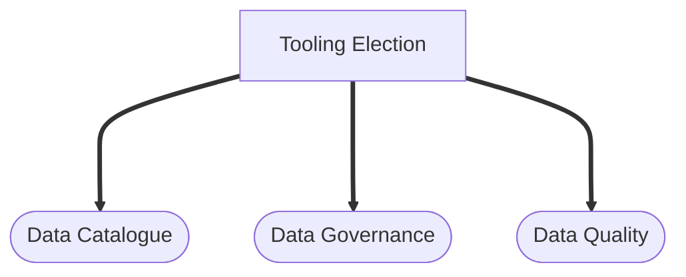
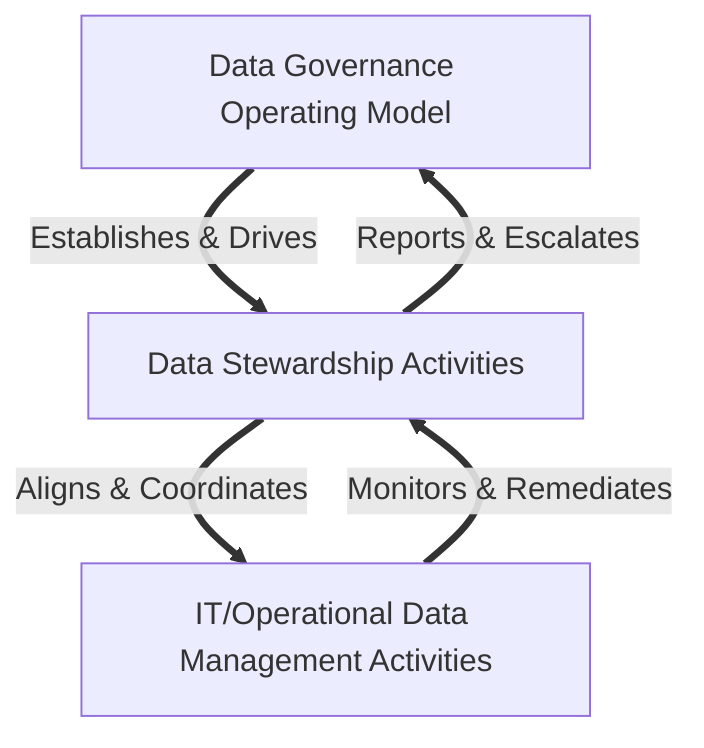
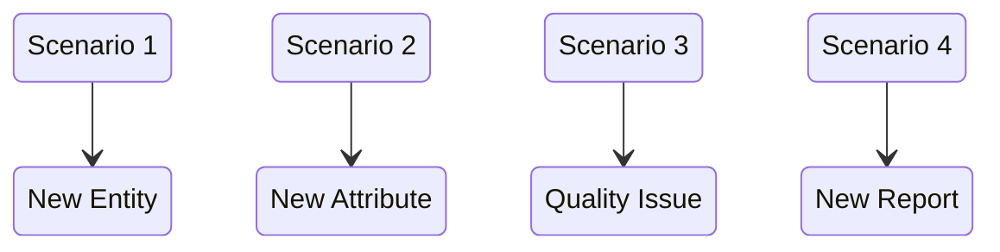

# DATA GOVERNANCE

1. Data Strategy

Es una nueva forma de gestionar estratégicamente los datos para alcanzar ventajas analíticas y conseguir nuestros objetivos de crecimiento.

Tenemos la necesidad de analizar que esperamos de un data strategy.

Estos son los requerimientos/pilares:

- Los datos pueden ser encontrados fácilmente.
- Los datos tienen que ser comprendidos con facilidad.
- Los datos son correctos.
- Los datos están completos
- Los datos son consistentes en el tiempo.
- Los datos necesitan ser trazados.

Hacia arquitecturas centradas en datos

Los problemas de análisis y presentación de informes se relacionan más a menudo con

problemas de gobierno de datos, no problemas de tecnología.

A medida que las organizaciones avanzan hacia un entorno data-centric world, el gobierno de datos se vuelve más crítico para asegurar que los datos sean consistentes, confiables y utilizables para analizar.

Un data strategy ayuda asegurando que los datos son gestionados y utilizados como un activo.

Cambio de mentalidad cultural

Business e IT, objetivos comunes

#

2. Roles y Responsabilidades

#

3. Modelo de datos
- Físico

Define los componentes y servicios de bases de datos lógicas que se requieren para construir un database o diseño de una ya existente.

Un modelo físico de datos consiste en la estructura de la tabla, los nombres de las columnas y valores, claves foráneas y primarias y la relaciones entre las tablas.

- Lógico

Describe los datos con el mayor detalle posible, independientemente a cómo serán los físicos implementados en la database. Características de un modelo de datos lógicos incluye: todas las entidades y relaciones entre ellas. Todos los atributos para cada entidad son especificados.

- Conceptual

Es una vista empresarial estructurada de los datos necesarios para dar soporte a los procesos del negocio, registrar eventos comerciales y

seguimiento de las medidas de rendimiento relacionadas.

Se centra en la identificación de los datos utilizados en el negocio, pero no en su procesamiento flujo o características físicas.

Tooling election

#

4. Comités y funcionamiento

Real scenarios

