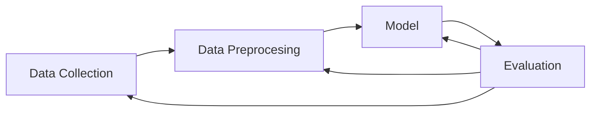
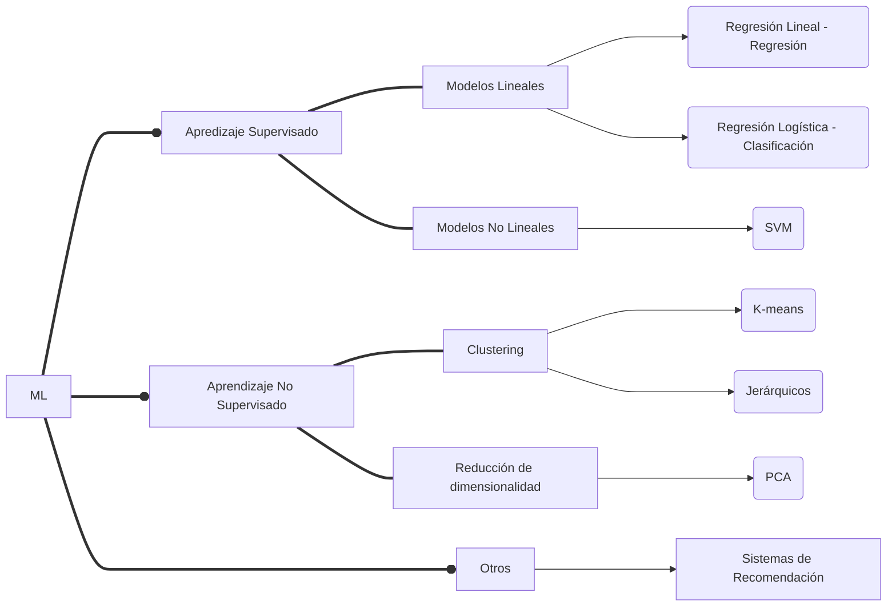

# DATA SCIENCE & MACHINE LEARNING
</strong>

<strong>
¿Qué es Data Science y Machine Learning?
</strong>

<strong>Data Science</strong> es un conjunto de herramientas, técnicas y disciplinas que se enfocan en convertir grandes cantidades de datos en información útil para explicar la relación entre variables y generar modelos predictivos.

<strong>Machine Learning</strong>, ML, o Aprendizaje Automático es una rama de la Inteligencia Artificial cuyo objetivo es construir sistemas que aprendan automáticamente de los datos.

#
</strong>

<strong>
Estructura Proyecto ML
</strong>

#
</strong>

<strong>
NLP: Procesamiento de Lenguaje Natural
</strong>

NLP se basa en algoritmos con mecanismos de atención que simulan el comportamiento del cerebro humano y entendimiento del lenguaje (chatbot).
Muchas mas precisión que modelos que buscan palabras claves.
Mejora la experiencia de usuario de los clientes con un servicio “inteligente” 24x7 y automático.

#

<strong>
Aprendizaje Supervisado VS No Supervisado
</strong>

<strong>Supervisado:</strong> Clasificación vs Regresión
<strong>No Supervisado:</strong>
 Clustering, reducción de dimensionalidad
</strong>

<strong>Supervisado:</strong> Para entrenar el modelo se utiliza un dataset o conjunto de muestras etiquetado (train).
El objetivo es predecir la etiqueta que tendrán futuras muestras (test) que el modelo no ha visto en su entrenamiento.
- Clasificar si un correo es spam o no.
- Predecir la producción de energía solar producida en una planta.

<strong>No Supervisado:</strong> Para entrenar el modelo se utiliza un dataset o conjunto de muestras sin etiquetar.
El objetivo es encontrar patrones en los datos para extraer conocimiento útil.
- Segmentar tus usuarios en 2 grupos.
- Reducción a 2 dimensiones.

<strong>
Resumen
</strong>

RESUMEN APRENDIZAJE SUPERVISADO vs APRENDIZAJE NO SUPERVISADO

| | <strong>Supervisado</strong> | <strong>No Supervisado</strong> |
| :---: | :---: | :---: |
| <strong>Etiquetas</strong> | SI | NO |
| <strong>Objetivo</strong> | Dar predicciones a futuro sobre el conjunto de test | Encontrar patrones en los datos o reducir dimensiones |
| <strong>Modelos</strong> | Regresión lineal, árboles, SVM, Redes Neuronales | Clustering, PCA |
| <strong>Ejemplo</strong> | Predecir si una transacción es fraudulenta | Encontrar clientes con perfiles similares |

#
# RESUMEN MODELOS

El siguiente esquema es un resumen de los modelos que veremos en los siguientes markdowns en este mismo repositorio de mis apuntes de Machine Learning:

