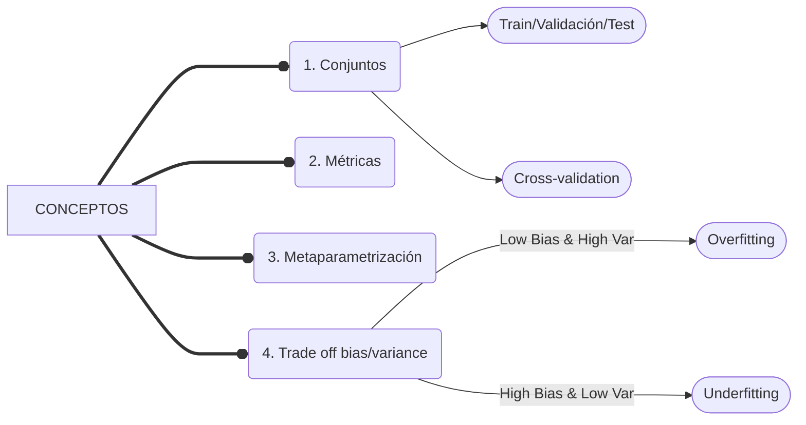

# APRENDIZAJE SUPERVISADO

 - <strong>Clasificación</strong>, las etiquetas son categóricas, indicando la pertenencia de una determinada muestra a una clase en particular.
 - <strong>Regresión</strong>, las etiquetas son numéricas, indicando un valor asociado a cada muestra.

#

<strong>
Métricas
</strong>

Clasificación. Matriz de confusión.
 - True Positives (TP)
 - False Negatives (FN)
 - False Positives (FP)
 - True Negatives (TN)

<strong>Clasificación:</strong>

 - <strong>Accuracy</strong>: Porcentaje de aciertos del modelo.
 - <strong>Sensibilidad o recall, VPR</strong>: ratio de verdaderos positivos.
 - <strong>Especificad, VNR</strong>: ratio de verdaderos negativos.
 - <strong>Precisión</strong>: probabilidad de que, dada una predicción positiva, la realidad sea positiva también.
 - <strong>F1-score</strong>: f1-score es una medida que mezcla la precisión y el recall. Mide si nuestro modelo tiene falsos positivos y falsos negativos a la vez.

<strong>Clasificación. ROC-AUC</strong>

En Machine Learning, la medición del rendimiento es una tarea esencial. Entonces, cuando se trata de un problema de clasificación, podemos contar con una curva AUC-ROC. Esta es una de las métricas de evaluación más importante para verificar el rendimiento de cualquier modelo de clasificación.

 - La curva ROC se define por FPR (Ratio Falsos Positivos) y VPR (Ratio True Positive) como ejes x e y respectivamente.
 - Representa los intercambios entre verdaderos positivos (beneficios) y falsos positivos (costes).
 - Cada valor umbral usado como punto de corte para distinguir entre qué es una predicción positiva y qué una negativa representa un punto en el espacio ROC.

Más en profundidad [aquí.](https://aprendeia.com/curvas-roc-y-area-bajo-la-curva-auc-machine-learning/)

#

<strong>Regresión</strong>

El  análisis de regresión  es un subcampo del aprendizaje automático supervisado cuyo objetivo es  establecer un método  para la relación entre un cierto número de características y una variable objetivo continua.

En este sentido, el ejemplo más común es la regresión lineal. ¿Qué significa este concepto? Se trata de un algoritmo de aprendizaje supervisado que se utiliza en ML y en estadística y, en términos sencillos, establece una recta para proporcionar la tendencia de un conjunto de datos.

 - <strong>MAE o Error absoluto medio</strong>: es la media de la diferencia absoluta entre los puntos de datos reales y el valor de predicción.
 - <strong>MSE o Error cuadrático medio</strong>: es la media de la diferencia entre los puntos reales de datos y el valor de predicción al cuadrado. Penaliza más las diferencias mayores o extremas.
 - <strong>RMSE</strong>: Raíz cuadrada del MSE. Proporciona mayor intuición que el MSE.
 - <strong>MAPE o Error absoluto porcentual medio</strong>: Permite medir error relativos a la magnitud del valor real.

#
RESUMEN APRENDIZAJE SUPERVISADO
CLASIFICACIÓN vs REGRESIÓN
| | Clasificación | Regresión |
| --- | --- | --- |
| Etiquetas | Categóricas | Numéricas |
| Ejemplo | Predecir si un email es spam (1) o no (0) | Predecir el precio de alquiler de una casa (550,632,1057…) |
| Métrica | AUC | MSE |

#

<strong>
CONCEPTOS MACHINE LEARNING - SUPERVISADO
</strong>

#

<strong>
1. Conjuntos
</strong>

 <strong>1.1 Train/Validation/Test</strong>

- Muestra de Entrenamiento <strong>(Training):</strong> Datos de los que los modelos extraen patrones. Son los únicos para los que el modelo “ve” el target o etiqueta a predecir.
- Muestra de Validación <strong>(Validation):</strong> Se emplea para seleccionar el mejor de los modelos entrenados cuando realizamos el ajuste de parámetros o metamodelización.
- Muestra de Prueba <strong>(Test):</strong> Proporciona el error real esperado con el modelo seleccionado.

<strong>1.2 Cross-validation</strong>
Es un método alternativo para realizar la optimización de hiperparámetros. Permite no tener que crear un conjunto de validación, sustituyendo su funcionalidad por la siguiente metodología:

- Se hace una separación del datatest en k subconjuntos del mismo tamaño.
- Se realiza el k -1 conjuntos para entrenar y 1 para validación.
- Se repite el procedimiento k veces rotando el conjunto de validación.
- Se evalúa con la métrica seleccionada.

#

<strong>
2. Métricas
</strong>

- Para comparar el rendimiento obtenido por cada combinación de tipo de modelos y conjunto de hiperparámetros necesitaremos de un valor numérico que nos informe de su bondad predictiva.
- Este valor numérico vendrá dado por la métrica elegida.
- La elección de esta métrica dependerá del tipo de problema, de los datos y del objetivo a solucionar.
- Ejemplo: MAE
#

<strong>
3. Metaparametrización 
</strong>

- Los modelos ML suelen incluir un conjunto de hiperparámetros que nos permiten controlar su comportamiento.
- De su correcta elección dependerá la bondad del modelo entrenado.
- Los hiperparámetros dependen del perfil de los datos que estamos analizando (problem-dependent), por lo que no es sencillo establecer un procedimiento estándar para su obtención.

<strong>3.1 Grid search </strong>
1. Elegimos una familia de modelos.
2. Elegimos unos hiperparámetros a optimizar, les llamaremos par1 y par2.
3. Para cada hiperparámetro, elegimos una serie de valores a probar.

| par2/par2 | 10 | 100 | 1000 |
| --- | --- | --- | --- |
| 0.1 | 0.3 | 0.22 | 0.25 |
| 0.01 | 0.15 | 0.14 | 0.14 |
| 0.001 | 0.35 | <strong> 0.05 
 | 0.11 |

 - Entrenamos nuestro modelo sobre el conjunto de train con los diferentes hiperparámetros haciendo todas las combinaciones posibles.
 - Hacemos la predicción de los diferentes modelos sobre el conjunto de validación y calculamos el error con la métrica seleccionada.
 - Escogemos el que mejor métrica obtenga y lo aplicamos sobre el conjunto de test para ver el error final esperado de nuestro modelo.
#

<strong>
 - Trade off bias/variance 
</strong>

 - <strong>Bias:</strong>
	 - El sesgo es la diferencia entre la predicción promedio de nuestro modelo y el valor correcto que estamos tratando de predecir.
	 - El modelo con alto sesgo presta muy poca atención a los datos de entrenamiento y simplifica en exceso el modelo.
	 - Un modelo muy sesgado siempre da un error alto en los datos de train. <strong>Underfitting</strong>.

 - <strong>Variance</strong>:
	 - Es la variabilidad de las predicciones cuando se introducen datos que difieren entre sí.
	 - El modelo con alta variación se ajusta mucho a los datos de entrenamiento y no generaliza bien con datos que no ha visto antes.
	 - Dichos modelos funcionan muy bien con los datos de entrenamiento pero tienen altos índices de error en los datos de prueba. <strong>Overfitting</strong>.
