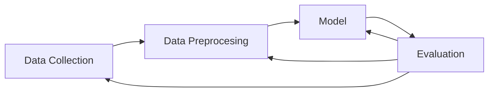

# DATA SCIENCE & MACHINE LEARNING
</strong>

<strong>
¿Qué es Data Science y Machine Learning?
</strong>

<strong>Data Science</strong> es un conjunto de herramientas, técnicas y disciplinas que se enfocan en convertir grandes cantidades de datos en información útil para explicar la relación entre variables y generar modelos predictivos.

<strong>Machine Learning</strong>, ML, o Aprendizaje Automático es una rama de la Inteligencia Artificial cuyo objetivo es construir sistemas que aprendan automáticamente de los datos.

#
</strong>

<strong>
Estructura Proyecto ML
</strong>

#
</strong>

<strong>
NLP: Procesamiento de Lenguaje Natural
</strong>

NLP se basa en algoritmos con mecanismos de atención que simulan el comportamiento del cerebro humano y entendimiento del lenguaje (chatbot).
Muchas mas precisión que modelos que buscan palabras claves.
Mejora la experiencia de usuario de los clientes con un servicio “inteligente” 24x7 y automático.

#

<strong>
Aprendizaje Supervisado VS No Supervisado
</strong>

<strong>Supervisado:</strong> Clasificación vs Regresión
<strong>No Supervisado:</strong>
 Clustering, reducción de dimensionalidad
</strong>

<strong>Supervisado:</strong> Para entrenar el modelo se utiliza un dataset o conjunto de muestras etiquetado (train). El objetivo es predecir la etiqueta que tendrán futuras muestras (test) que el modelo no ha visto en su entrenamiento.
• Clasificar si un correo es spam o no.
• Predecir la producción de energía solar producida en una planta.

<strong>No Supervisado:</strong> Para entrenar el modelo se utiliza un dataset o conjunto de muestras sin etiquetar. El objetivo es encontrar patrones en los datos para extraer conocimiento útil.
• Segmentar tus usuarios en 2 grupos.
• Reducción a 2 dimensiones.

<strong>
Resumen
</strong>

RESUMEN APRENDIZAJE SUPERVISADO vs APRENDIZAJE NO SUPERVISADO

<<<<<<< HEAD
| | <strong>Supervisado</strong> | <strong>No Supervisado</strong> |
| :---: | :---: | :---: |
| <strong>Etiquetas</strong> | SI | NO |
| <strong>Objetivo</strong> | Dar predicciones a futuro sobre el conjunto de test | Encontrar patrones en los datos o reducir dimensiones |
| <strong>Modelos</strong> | Regresión lineal, árboles, SVM, Redes Neuronales | Clustering, PCA |
| <strong>Ejemplo</strong> | Predecir si una transacción es fraudulenta | Encontrar clientes con perfiles similares |

=======
#

# APRENDIZAJE SUPERVISADO

 - <strong>Clasificación</strong>, las etiquetas son categóricas, indicando la pertenencia de una determinada muestra a una clase en particular.
 - <strong>Regresión</strong>, las etiquetas son numéricas, indicando un valor asociado a cada muestra.

#

<strong>
Métricas
</strong>

Clasificación. Matriz de confusión.
 - True Positives (TP)
 - False Negatives (FN)
 - False Positives (FP)
 - True Negatives (TN)

<strong>Clasificación:</strong>

 - <strong>Accuracy</strong>: Porcentaje de aciertos del modelo.
 - <strong>Sensibilidad o recall, VPR</strong>: ratio de verdaderos positivos.
 - <strong>Especificad, VNR</strong>: ratio de verdaderos negativos.
 - <strong>Precisión</strong>: probabilidad de que, dada una predicción positiva, la realidad sea positiva también.
 - <strong>F1-score</strong>: f1-score es una medida que mezcla la precisión y el recall. Mide si nuestro modelo tiene falsos positivos y falsos negativos a la vez.

#

<strong>Clasificación. ROC-AUC</strong>

En Machine Learning, la medición del rendimiento es una tarea esencial. Entonces, cuando se trata de un problema de clasificación, podemos contar con una curva AUC-ROC. Esta es una de las métricas de evaluación más importante para verificar el rendimiento de cualquier modelo de clasificación.

 - La curva ROC se define por FPR (Ratio Falsos Positivos) y VPR (Ratio True Positive) como ejes x e y respectivamente.
 - Representa los intercambios entre verdaderos positivos (beneficios) y falsos positivos (costes).
 - Cada valor umbral usado como punto de corte para distinguir entre qué es una predicción positiva y qué una negativa representa un punto en el espacio ROC.

Más en profundidad [aquí.](https://aprendeia.com/curvas-roc-y-area-bajo-la-curva-auc-machine-learning/)

#

<strong>Regresión</strong>

El  análisis de regresión  es un subcampo del aprendizaje automático supervisado cuyo objetivo es  establecer un método  para la relación entre un cierto número de características y una variable objetivo continua.

En este sentido, el ejemplo más común es la regresión lineal. ¿Qué significa este concepto? Se trata de un algoritmo de aprendizaje supervisado que se utiliza en ML y en estadística y, en términos sencillos, establece una recta para proporcionar la tendencia de un conjunto de datos.

 - <strong>MAE o Error absoluto medio</strong>: es la media de la diferencia absoluta entre los puntos de datos reales y el valor de predicción.
 - <strong>MSE o Error cuadrático medio</strong>: es la media de la diferencia entre los puntos reales de datos y el valor de predicción al cuadrado. Penaliza más las diferencias mayores o extremas.
 - <strong>RMSE</strong>: Raíz cuadrada del MSE. Proporciona mayor intuición que el MSE.
 - <strong>MAPE o Error absoluto porcentual medio</strong>: Permite medir error relativos a la magnitud del valor real.

#
RESUMEN APRENDIZAJE SUPERVISADO
CLASIFICACIÓN vs REGRESIÓN
| | Clasificación | Regresión |
| --- | --- | --- |
| Etiquetas | Categóricas | Numéricas |
| Ejemplo | Predecir si un email es spam (1) o no (0) | Predecir el precio de alquiler de una casa (550,632,1057…) |
| Métrica | AUC | MSE |

#
# APRENDIZAJE NO SUPERVISADO
Características:
 - <strong>Objetivo</strong>: Para entrenar el modelo se utiliza un dataset o conjunto de muestras sin etiquetar. El objetivo aquí no es predecir un target sino encontrar patrones en los datos para extraer conocimiento útil.
 
 - <strong>Tipos</strong>: 2 clases principales de problemas:
	 1. Clustering.
	2. Reducción de dimensionalidad.
#
<strong>Segmentación o clustering</strong>
 - <strong>Objetivo</strong>: Clustering es la tarea de agrupar un conjunto de objetos tales que los objetos en el mismo grupo (clúster) son más similares entre sí que a los de otros grupos.
 - Métodos de agrupación:
	 - <strong>Métodos jerárquicos</strong>: se descomponen en forma de árbol el conjunto de datos.
	 - <strong>Métodos de partición</strong>: se crean divisiones sucesivas del conjunto de datos.

Ejemplos: K-means y K-prototypes

#
<strong>Reducción de dimensionalidad</strong>

 - <strong>Objetivo</strong>: Reducir el número de variables o columnas en un dataset. Con esto se busca:
	 - Disminuir coste computacional o
	 - Conseguir un nuevo dataset con menos variables irrelevantes o ruido.
	 - Realizar visualizaciones
	 - …

Ejemplo: PCA
>>>>>>> main
