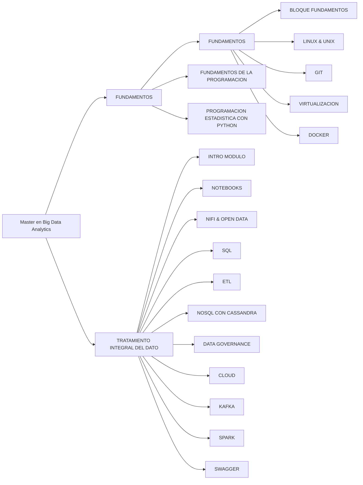

# Master Big Data Analytics

```mermaid
flowchart LR
A[Master en Big Data Analytics] -->B[FUNDAMENTOS];
A[Master en Big Data Analytics] -->C[TRATAMIENTO INTEGRAL DEL DATO];
B[FUNDAMENTOS] -->D[FUNDAMENTOS];
B[FUNDAMENTOS] -->E[FUNDAMENTOS DE LA PROGRAMACION]
B[FUNDAMENTOS] -->F[PROGRAMACION ESTADISTICA CON PYTHON]
D[FUNDAMENTOS] -->G[BLOQUE FUNDAMENTOS]
D[FUNDAMENTOS] -->H[LINUX & UNIX]
D[FUNDAMENTOS] -->I[GIT]
D[FUNDAMENTOS] -->J[VIRTUALIZACION]
D[FUNDAMENTOS] -->K[DOCKER]
C[TRATAMIENTO INTEGRAL DEL DATO] -->L[INTRO MODULO]
C[TRATAMIENTO INTEGRAL DEL DATO] -->M[NOTEBOOKS]
C[TRATAMIENTO INTEGRAL DEL DATO] -->N[NIFI & OPEN DATA]
C[TRATAMIENTO INTEGRAL DEL DATO] -->O[SQL]
C[TRATAMIENTO INTEGRAL DEL DATO] -->P[ETL]
C[TRATAMIENTO INTEGRAL DEL DATO] -->Q[NOSQL CON CASSANDRA]
C[TRATAMIENTO INTEGRAL DEL DATO] -->R[DATA GOVERNANCE]
C[TRATAMIENTO INTEGRAL DEL DATO] -->S[CLOUD]
C[TRATAMIENTO INTEGRAL DEL DATO] -->T[KAFKA]
C[TRATAMIENTO INTEGRAL DEL DATO] -->U[SPARK]
C[TRATAMIENTO INTEGRAL DEL DATO] -->V[SWAGGER]
```
