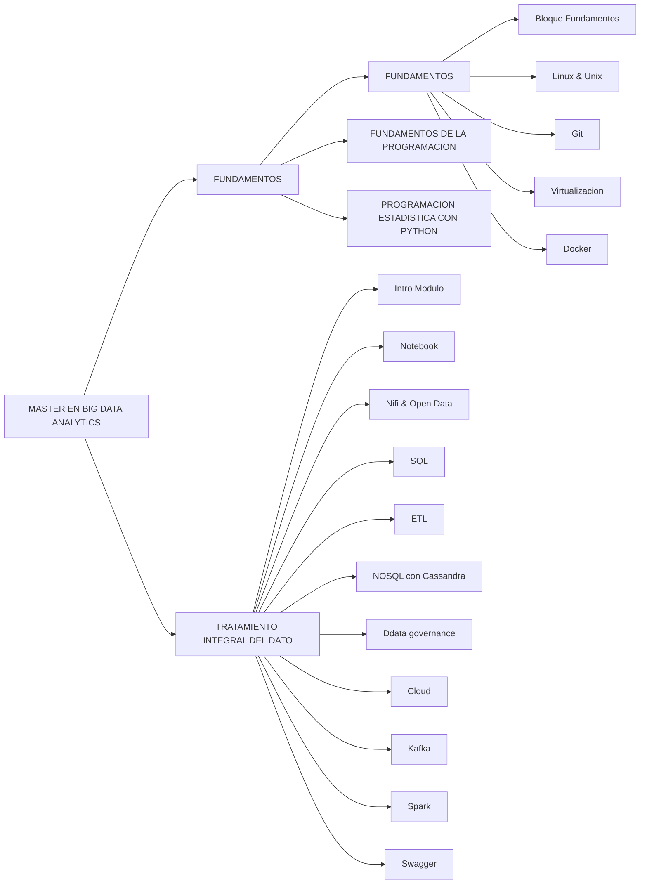

```mermaid
flowchart LR
A[MASTER EN BIG DATA ANALYTICS] -->B[FUNDAMENTOS];
A[MASTER EN BIG DATA ANALYTICS] -->C[TRATAMIENTO INTEGRAL DEL DATO];
B[FUNDAMENTOS] -->D[FUNDAMENTOS];
B[FUNDAMENTOS] -->E[FUNDAMENTOS DE LA PROGRAMACION]
B[FUNDAMENTOS] -->F[PROGRAMACION ESTADISTICA CON PYTHON]
D[FUNDAMENTOS] -->G[Bloque Fundamentos]
D[FUNDAMENTOS] -->H[Linux & Unix]
D[FUNDAMENTOS] -->I[Git]
D[FUNDAMENTOS] -->J[Virtualizacion]
D[FUNDAMENTOS] -->K[Docker]
C[TRATAMIENTO INTEGRAL DEL DATO] -->L[Intro Modulo]
C[TRATAMIENTO INTEGRAL DEL DATO] -->M[Notebook]
C[TRATAMIENTO INTEGRAL DEL DATO] -->N[Nifi & Open Data]
C[TRATAMIENTO INTEGRAL DEL DATO] -->O[SQL]
C[TRATAMIENTO INTEGRAL DEL DATO] -->P[ETL]
C[TRATAMIENTO INTEGRAL DEL DATO] -->Q[NOSQL con Cassandra]
C[TRATAMIENTO INTEGRAL DEL DATO] -->R[Ddata governance]
C[TRATAMIENTO INTEGRAL DEL DATO] -->S[Cloud]
C[TRATAMIENTO INTEGRAL DEL DATO] -->T[Kafka]
C[TRATAMIENTO INTEGRAL DEL DATO] -->U[Spark]
C[TRATAMIENTO INTEGRAL DEL DATO] -->V[Swagger]
```
